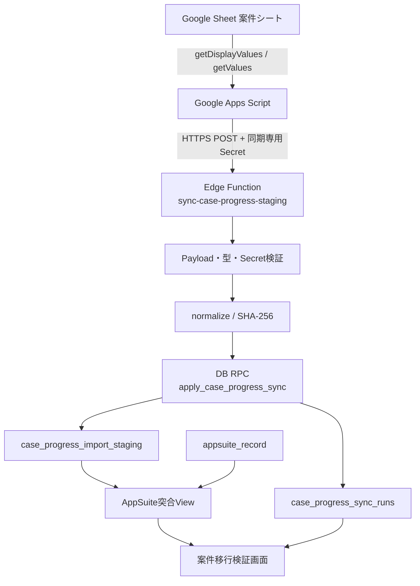

# 案件進捗管理 Google スプレッドシート日次同期 設計書

## 1. 目的

管理部が Google スプレッドシート「2026　案件進捗管理」の「案件シート」で管理している案件進捗を、1 日 1 回 Supabase へ一方向同期する。同期先は検証用 staging とし、既存の AppSuite ワークフローとの突合および正式な案件モデル設計の検証に利用する。

本機能では Google Sheet、AppSuite、正式案件・費用・会計・支払データを更新しない。Google Sheet を現時点の原本とし、取得値、変換結果、同期履歴、未検出状態を追跡できることを優先する。

## 2. 対象範囲

### 2.1 対象

- Spreadsheet ID: `1NgMHz3krxkEb8Lz13-9VcrPwgfKEnFyBi3cEodFQLs8`
- 対象シート: `案件シート`
- タイムゾーン: `Asia/Tokyo`
- 実行頻度: 毎日 1 回、4 時台 JST
- データフロー: Google Sheet → Google Apps Script → Supabase Edge Function → staging
- AppSuite 突合: 正規化後の稟議 No による完全一致
- 検証画面: システム管理者向けの read-only 画面

### 2.2 対象外

- Google Sheet および AppSuite への書戻し
- Google Sheet の値や ID の自動補正
- `cases`、費用、会計、支払、収支関連テーブルへの登録
- Workflow の自動生成
- 稟議 No の推測補完
- 正式案件モデルの確定

## 3. 現状調査結果

### 3.1 Supabase と Migration

- ローカルの全 Migration は 2026-09-17 分までリモートへ適用済みであり、`supabase migration list` 上で差分はない。
- AppSuite 同期は `appsuite_application`、`appsuite_record`、`appsuite_sync_run`、`appsuite_sync_preview` を利用している。
- 既存 Edge Function `sync-appsuite-records` は、同期履歴作成、upsert、ソースから消えた行の `is_present = false` 化を実装している。本機能でもこの考え方を踏襲する。
- `appsuite_record.ringi_number` と、`normalize_appsuite_ringi_number(text)` を使う式インデックスが存在する。稟議 No の突合にはこの正規化関数を再利用する。
- Edge Function からの DB 書込みは、既存と同様にサーバー側の service role を利用できる。

### 3.2 マスタ

- 物件系の現行正規マスタは、`property_master` から統合された `asset_master` である。案件シートの「ビル名称」との対応候補は `asset_master.asset_name`、`short_name` とする。
- 担当者の正規マスタは `employee_master` である。`user_profiles` はログインアカウントとの関連であり、担当者全員がログインユーザーとは限らないため、将来の担当者参照先は `user_id` ではなく `employee_id` とする。
- 案件の「項目」および「ステータス」に直接対応する既存の共通マスタは、今回確認した範囲では存在しない。同期時に新規マスタは作らず原文を保持する。

### 3.3 React と権限

- ルーティングは `src/App.tsx` の React Router に集約されている。
- 管理者限定画面には既存の `AdminOnly` を利用できる。
- DB 側には `current_account_is_active()`、`current_account_is_admin()`、`current_account_role()` があり、RLS の共通判定として利用されている。
- 新画面は `/admin/case-progress-migration` とし、管理者メニューへ「案件移行検証」を追加する。

### 3.4 Google Sheet 接続確認結果

2026-09-18 に、既存の Apps Script プロジェクトから `SpreadsheetApp.openById()` を使って対象 Sheet を直接参照できることを確認した。匿名 CSV エクスポートは HTTP 401 となるが、インストール型トリガーは作成者の Google アカウント権限で実行されるため、本番同期では問題にならない。Sheet を一般公開しない。

確認時点の結果は次のとおり。

| 項目 | 結果 |
| --- | --- |
| Spreadsheet 名 | `2026 案件進捗管理` |
| Spreadsheet ID | 設計対象 ID と一致 |
| タイムゾーン | `Asia/Tokyo` |
| Sheet 名 | `案件シート` |
| 最終使用行 | 558 行目 |
| 列数 | 14 列 |
| データ行数 | 557 件 |
| ID 件数 | 557 件 |
| ID 空欄 | 0 件 |
| ID 重複 | 0 件 |
| 必須ヘッダー不足 | なし |
| ヘッダー重複 | なし |

14 個のヘッダーは指示書記載の名称・順序と一致した。ID 振り直し後の再確認では、557 件すべてに ID があり重複もない。初回同期は全件を `id:<legacy_case_id>` の strong identity で取り込める。行番号 fallback は将来の入力漏れで同期全体を停止させないための例外処理として残し、ID 空欄件数を画面と同期履歴で可視化する。

次の項目は、追加診断または初回手動同期で確認する。

- ID セルの実値と表示値の差、および先頭ゼロの表示維持
- 稟議 No の空欄数、改行・空白・重複の状況
- 金額・日付セルの実型と表示形式
- 担当者・ビル・項目・ステータスの distinct 値と表記揺れ

## 4. 全体構成



同期 1 回につき HTTP リクエストは原則 1 回とする。今回の想定件数では chunk 化しない。DB 反映は 1 回の RPC・1 トランザクションにまとめ、行の一部だけが更新された状態を残さない。

## 5. Google Apps Script 設計

### 5.1 責務

Apps Script は次だけを担当する。

1. 対象 Spreadsheet と「案件シート」を取得する。
2. 1 行目のヘッダーを読み、必須 14 項目の有無と重複を検査する。
3. 全セルが空の行を除外し、元のシート行番号を付けて payload を作る。
4. Edge Function へ 1 回で POST する。
5. HTTP ステータス、run ID、集計結果またはエラーを実行ログへ出力する。

既存 Apps Script プロジェクトの `APP_CONFIG.SPREADSHEET_ID` と `APP_CONFIG.ISSUE_SHEET_NAME` を利用し、`SpreadsheetApp.openById()` と `getSheetByName()` で取得する。時間主導トリガーには active Spreadsheet がないため、`getActiveSpreadsheet()` には依存しない。

列番号は参照せず、ヘッダー名から値を取得する。ID の先頭ゼロと原文を保持するため `getDisplayValues()` を使用し、金額・日付の型判定用に `getValues()` も同時に取得する。

必須ヘッダー不足などの構造エラーを検出した場合は行データを同期せず、source 情報、取得できたヘッダー、エラーコードだけを失敗報告 payload として同じ Edge Function へ送る。これにより Apps Script の実行ログと Supabase の failed run の双方へ記録する。Sheet 自体を取得できない場合も、Edge Function へ接続可能なら同じ方式で失敗を報告する。

### 5.2 Payload

```json
{
  "sourceSystem": "google_sheets",
  "spreadsheetId": "1NgMHz3krxkEb8Lz13-9VcrPwgfKEnFyBi3cEodFQLs8",
  "sheetName": "案件シート",
  "spreadsheetTimeZone": "Asia/Tokyo",
  "triggerType": "scheduled",
  "clientError": null,
  "headers": ["ID", "担当者", "ビル名称", "案件名", "項目", "ステータス", "入力日", "処理予定日", "処理日", "稟議No", "予算", "決定金額", "完了予定日", "備考"],
  "rows": [
    {
      "sourceRowNumber": 2,
      "displayValues": { "ID": "000027", "予算": "¥40,000,000" },
      "typedValues": { "ID": 27, "予算": 40000000 }
    }
  ]
}
```

- 文字列・ID・原文は `displayValues` を正とする。
- 金額は `typedValues` が有限数値なら優先する。
- Apps Script の `Date` は Spreadsheet のタイムゾーンで `yyyy-MM-dd` に変換して `typedValues` に格納する。日付を UTC 時刻へ変換しない。
- 手動実行時は `triggerType = manual`、時間主導トリガー時は `scheduled` とする。
- 失敗報告時だけ `clientError` を `{ "code": "MISSING_REQUIRED_HEADER", "message": "..." }` とし、`rows` は送らない。message にセル値や Secret を含めない。
- payload に Secret、service role、ユーザー認証情報を含めない。

### 5.3 Script Properties と HTTP

Script Properties は次の 2 項目とする。

- `CASE_PROGRESS_SYNC_URL`
- `CASE_PROGRESS_SYNC_SECRET`

Secret は `x-case-progress-sync-secret` ヘッダーで送る。Apps Script ソース、セル、Git には保存しない。

### 5.4 Trigger

- `syncCaseProgress()` を手動・自動共通の実行関数とする。
- `setupDailyTrigger()` は既存の `syncCaseProgress` 用 trigger を削除してから、4 時台 JST の trigger を 1 件だけ作成する。
- Spreadsheet のタイムゾーンが `Asia/Tokyo` でない場合は trigger 作成を中止し、設定差異を表示する。

## 6. Edge Function 設計

### 6.1 Endpoint

- Function 名: `sync-case-progress-staging`
- 許可メソッド: `POST`、および必要な `OPTIONS`
- `supabase/config.toml`: `verify_jwt = false`

Google Apps Script は Supabase JWT を持たないため Gateway の JWT 検証は無効にし、Function 内で同期専用 Secret を必須検証する。Secret が未設定または不一致なら DB 接続前に `401` を返す。

### 6.2 処理順序

1. Method と同期専用 Secret を検証する。
2. JSON 構造、固定の Spreadsheet ID、sheet 名、タイムゾーン、必須ヘッダー、行番号を検証する。
3. `case_progress_sync_runs` に `running` を登録する。
4. 全行を normalize し、変換警告を行単位で収集する。
5. `source_key` の重複がないことを検査する。
6. normalize 後の一定順序の値から SHA-256 `source_hash` を生成する。
7. RPC `apply_case_progress_sync` を 1 回呼び出す。
8. RPC 内で staging 反映と同時に、警告 0 件なら `success`、警告ありなら `partial` として run を完了する。
9. client error、構造・重複・DB エラー時は run を `failed` に更新して 4xx/5xx を返す。

認証前の失敗は DB に記録しない。認証後かつ run 作成後の失敗は `error_message` に秘密情報・payload 全文を含めず記録する。

## 7. Normalize・検証仕様

### 7.1 共通文字列

- 原文列は表示値をそのまま保持する。
- normalize 用の文字列は前後空白を除去する。
- 全項目が空の行は Apps Script 側で対象外にする。

### 7.2 ID と source key

- ID は必ず text とし、数値化しない。
- ID あり: `source_key = id:<legacy_case_id>`、`identity_quality = strong`
- ID なし: `source_key = row:<source_row_number>`、`identity_quality = fallback`
- 同一 payload 内で `source_key` が重複した場合は全体を `failed` とし、upsert や inactive 化を行わない。

### 7.3 稟議 No

- 元値は `approval_no_raw` に保持する。
- 正規化は既存 `normalize_appsuite_ringi_number(text)` と意味を揃え、前後空白、CR/LF、半角・全角空白を除去し、英字を大文字化する。
- `null`、空文字、`-`、`ー` は `approval_no_normalized = null` とする。
- 推測、部分一致、前方一致は行わない。

### 7.4 金額

- typed value が有限数値ならその値を使用する。
- 文字列の場合は通貨記号 `¥`、カンマ、半角・全角空白を除去した後、全体が数値形式の場合だけ変換する。
- 空欄は `null` とする。
- 変換不能値は `null` とし、`validation_errors` に項目名と理由を記録する。0 円へ置換しない。

### 7.5 日付

- 対象は入力日、処理予定日、処理日、完了予定日である。
- typed value の `yyyy-MM-dd` を優先し、文字列は許可する既知形式を明示して parse する。
- 空欄は `null` とする。
- 変換不能値は `null` とし、`validation_errors` に記録する。
- DB 型は `date` とし、UTC 変換を行わない。

### 7.6 source hash

次の normalize 後値を、固定キー順の JSON として UTF-8 serialize し SHA-256 化する。

`legacy_case_id`、`manager_raw`、`building_raw`、`case_name_raw`、`category_raw`、`status_raw`、`input_date`、`planned_process_date`、`processed_date`、`approval_no_normalized`、`budget_amount`、`decided_amount`、`planned_completion_date`、`note`

行番号、同期日時、active 状態、validation error は変更判定に含めない。

## 8. DB 設計

### 8.1 `case_progress_import_staging`

| カラム | 型 | 制約・用途 |
| --- | --- | --- |
| `case_progress_import_staging_id` | uuid | PK、`gen_random_uuid()` |
| `source_system` | varchar(30) | NOT NULL、初期値 `google_sheets` |
| `spreadsheet_id` | text | NOT NULL |
| `sheet_name` | text | NOT NULL |
| `source_row_number` | integer | NOT NULL、2 以上 |
| `source_key` | text | NOT NULL |
| `legacy_case_id` | text | NULL 許可、先頭ゼロ保持 |
| `manager_raw` | text | 原文 |
| `building_raw` | text | 原文 |
| `case_name_raw` | text | 原文 |
| `category_raw` | text | 原文 |
| `status_raw` | text | 原文 |
| `input_date` | date | NULL 許可 |
| `planned_process_date` | date | NULL 許可 |
| `processed_date` | date | NULL 許可 |
| `approval_no_raw` | text | 原文 |
| `approval_no_normalized` | text | 突合用、NULL 許可 |
| `budget_amount` | numeric(14,0) | NULL 許可 |
| `decided_amount` | numeric(14,0) | NULL 許可 |
| `planned_completion_date` | date | NULL 許可 |
| `note` | text | 原文 |
| `raw_payload` | jsonb | NOT NULL、元行の表示値を保持 |
| `validation_errors` | jsonb | NOT NULL、既定 `[]` |
| `source_hash` | text | NOT NULL、SHA-256 hex |
| `identity_quality` | varchar(20) | `strong` / `fallback` |
| `source_active` | boolean | NOT NULL、既定 true |
| `missing_since` | timestamptz | 初回未検出時刻 |
| `first_seen_at` | timestamptz | 初回取込時刻 |
| `last_seen_at` | timestamptz | 原本で最後に確認した時刻 |
| `source_synced_at` | timestamptz | 今回の同期時刻 |
| `created_at` | timestamptz | NOT NULL |
| `updated_at` | timestamptz | NOT NULL、既存 `set_updated_at()` を利用 |

一意制約は `(source_system, spreadsheet_id, sheet_name, source_key)` とする。ID のない行は行移動で別行となり得るが、テスト移行段階では要件どおり許容する。

### 8.2 `case_progress_sync_runs`

| カラム | 型 | 制約・用途 |
| --- | --- | --- |
| `case_progress_sync_run_id` | uuid | PK |
| `started_at` | timestamptz | NOT NULL |
| `completed_at` | timestamptz | NULL 許可 |
| `status` | varchar(20) | `running` / `success` / `partial` / `failed` |
| `source_system` | varchar(30) | NOT NULL |
| `spreadsheet_id` | text | NOT NULL |
| `sheet_name` | text | NOT NULL |
| `trigger_type` | varchar(20) | `scheduled` / `manual` |
| `source_row_count` | integer | 0 以上 |
| `inserted_count` | integer | 0 以上 |
| `updated_count` | integer | 0 以上 |
| `unchanged_count` | integer | 0 以上 |
| `inactive_count` | integer | 0 以上 |
| `blank_id_count` | integer | 0 以上 |
| `error_count` | integer | 警告またはエラー行数 |
| `error_message` | text | 全体エラーの要約。payload・Secret は保存しない |
| `created_at` | timestamptz | NOT NULL |

正常・partial 時は `inserted_count + updated_count + unchanged_count = source_row_count` を満たす。

### 8.3 Index

- staging の一意制約用 index
- `(approval_no_normalized)` の NULL 除外 index
- `(source_active, source_synced_at desc)`
- `(legacy_case_id)` の NULL 除外 index
- sync runs の `(started_at desc)`

`source_key` と `source_active` の単独 index は、上記複合 index と実際の query plan を確認してから追加する。`appsuite_record` 側は既存の正規化稟議 No 式 index を再利用する。

## 9. DB 反映 RPC

`apply_case_progress_sync(p_sync_run_id uuid, p_source_system text, p_spreadsheet_id text, p_sheet_name text, p_synced_at timestamptz, p_rows jsonb)` を追加する。

- `SECURITY INVOKER` とし、`search_path` を固定する。
- `PUBLIC`、`anon`、`authenticated` から EXECUTE を revoke し、`service_role` のみに grant する。
- 対象 run が `running` で、source 情報が引数と一致することを検証する。
- payload 件数、source key 重複、必要フィールドを再検証する。
- 既存 hash と比較して inserted / updated / unchanged を集計する。
- 全行を upsert し、strong ID の行が移動した場合は `source_row_number` も更新する。
- 今回見つかった行は `source_active = true`、`missing_since = null` に戻す。
- 同一 source scope 内で今回の source key にない active 行だけを `source_active = false` とし、`missing_since` を初回だけ設定する。
- upsert、inactive 化、run の件数・`success` または `partial` への更新を同一トランザクションで実行し、集計値を JSON で返す。

空の `rows` は原則拒否する。原本の全件削除と取得異常を区別できないためである。将来、全件削除を正規操作として許可する場合は、明示フラグと二段階確認を別途設計する。

## 10. AppSuite 突合 View

`case_progress_migration_verification` を security invoker view として作成する。staging 1 行に対し、次を返す。

- staging の一覧表示項目
- `appsuite_match_count`
- 1 件一致時の `appsuite_record_id`、`app_id`、`data_id`、`approval_status`
- `match_status`
- `summary_group`

候補は `appsuite_record.is_present = true` かつ `is_cancelled = false` とし、既存正規化関数を通した稟議 No の完全一致で数える。

| 条件 | `match_status` | `summary_group` |
| --- | --- | --- |
| 稟議 No なし | `no_approval_no` | `sheet_only` |
| 候補 0 件 | `workflow_not_found` | `sheet_only` |
| 候補 1 件 | `matched` | `matched` |
| 候補 2 件以上 | `ambiguous` | `needs_review` |

指示書の `sheet_only` は `no_approval_no` と `workflow_not_found` をまとめるサマリー分類として保持する。詳細状態と集計分類を分けることで、「稟議前」と「番号はあるが未一致」を識別する。

突合結果は永続化せず view で都度算出する。AppSuite 再同期後も staging を更新せず最新結果を確認できる。

## 11. RLS・権限・Secret

- staging と sync runs は RLS を有効化する。
- `authenticated` の SELECT は `current_account_is_admin()` を満たすユーザーだけ許可する。
- browser role への INSERT / UPDATE / DELETE は grant しない。
- service role には同期に必要な DML と RPC 実行だけを許可する。
- view は基底テーブルの RLS を適用する `security_invoker = true` とする。
- React には anon key 以外の鍵を置かない。
- Apps Script には同期専用 Secret だけを置き、service role を置かない。
- Edge Function の Secret 名は `CASE_PROGRESS_SYNC_SECRET` とし、Supabase Function Secret として設定する。
- エラー応答・ログ・run 履歴へ Secret、Authorization header、raw payload 全文を出力しない。

## 12. React「案件移行検証」画面

### 12.1 ルートとアクセス

- Route: `/admin/case-progress-migration`
- Guard: 既存 `AdminOnly`
- サイドバー: admin のみ「案件移行検証」を表示
- 操作: 参照、絞込みのみ。同期実行、編集、削除、AppSuite 更新は行わない。

### 12.2 サマリー

- active な Google Sheet 件数
- AppSuite 一致件数
- Sheet のみ件数
- 要確認件数
- 稟議 No なし件数
- ID なし件数
- 最終同期日時、status、inserted / updated / unchanged / inactive / error 件数

### 12.3 一覧

表示列は Google Sheet ID、担当者、ビル、案件名、項目、ステータス、稟議 No、予算、決定金額、突合結果、active、最終同期日時とする。金額は `ja-JP` の通貨表示、日付・時刻は JST 表示とする。

フィルターは担当者、ビル、ステータス、突合結果、ID なし、active とする。初期表示は active のみとし、inactive は明示的に切り替えて確認する。

数百件規模のため初期実装はクライアント側フィルターでよい。件数増加または PostgREST の既定取得上限に近づいた場合は server-side pagination に移行する。

## 13. マスタ対応の扱い

初期同期では raw 値を staging に保持し、`asset_id` や `employee_id` を自動確定・永続化しない。Google Sheet の `01_小山`、`01_金藤` 等の接頭辞の意味と一意性が実データで確認できていないためである。

初回同期後、次を集計して正式案件モデル設計の資料とする。

- `building_raw` ごとの件数と `asset_master.asset_name / short_name` の候補数
- `manager_raw` ごとの件数と `employee_master.employee_name` の候補数
- category、status の distinct 値と件数
- 一致 0 件・複数件の値

接頭辞除去や別名対応は、実データと業務ルールを確認後に専用マッピングとして設計する。文字列の曖昧一致で自動確定しない。

## 14. エラーと再実行

| 条件 | HTTP / run | DB 反映 |
| --- | --- | --- |
| Method 不正 | 405 / run なし | なし |
| Secret 不正 | 401 / run なし | なし |
| Spreadsheet・sheet 不一致 | 400 / failed | なし |
| 必須ヘッダー不足・重複 | 400 / failed | なし |
| payload 構造不正 | 400 / failed | なし |
| source key 重複 | 409 / failed | なし |
| 金額・日付の一部変換不能 | 200 / partial | 原文を保持し該当 normalize 値を NULL で反映 |
| RPC・DB エラー | 500 / failed | RPC 全体 rollback |
| 通信失敗 | Apps Script log | DB 到達前ならなし。再実行可能 |

再実行は source key と hash により冪等になる。前回 `running` のまま残った run はデータ反映の根拠に使わず、運用上確認できるよう画面に表示する。自動的な成功扱いや staging の物理削除は行わない。

## 15. 実装対象ファイル

実装時の想定変更は次のとおりとする。既存構造に合わせ、必要以上に分割しない。

- `supabase/migrations/20260918045805_create_case_progress_import.sql`
- `supabase/functions/sync-case-progress-staging/index.ts`
- `supabase/functions/sync-case-progress-staging/logic.ts`
- `supabase/functions/sync-case-progress-staging/logic.test.ts`
- `supabase/config.toml`
- `scripts/google-apps-script/case-progress-sync.gs`
- `src/CaseProgressMigrationPage.tsx`
- `src/App.tsx`
- 既存スタイルまたは必要最小限の画面 CSS
- `docs/case-progress-sync-setup.md`
- `supabase/tests/case_progress_import_schema.sql`

Migration ファイルは `npx supabase migration new create_case_progress_import` で作成する。

## 16. 検証計画

### 16.1 DB・Function

- Migration をローカル DB reset で再現できる。
- RLS により admin は参照でき、manager / staff / viewer / anon は参照・更新できない。
- RPC は service role 以外から実行できない。
- 初回同期、同一再同期、単一項目更新、ID 空欄、稟議 No 改行、稟議 No なし、行削除、再出現を確認する。
- 同一 ID、必須ヘッダー不足、誤 Secret、金額・日付変換失敗で設計どおりの結果になる。
- RPC 内で意図的に失敗させ、staging が部分更新されないことを確認する。
- AppSuite 0 件、1 件、複数件で view の分類を確認する。

### 16.2 Apps Script

- 表示値 `000001` がそのまま送信される。
- 列順変更後もヘッダー名で取得できる。
- trigger setup を複数回実行しても対象 trigger が 1 件になる。
- `syncCaseProgress()` を Editor から手動実行できる。
- 実行ログに run ID と集計または具体的エラーが残る。

### 16.3 React

- admin のみメニュー・URLへアクセスできる。
- サマリーと一覧の件数が view / run と一致する。
- 各フィルターと inactive 表示切替が機能する。
- 書込み操作が存在しない。

### 16.4 コマンド

- `npm run typecheck`
- `npm run build`
- `npm run supabase:test`
- Edge Function の normalize / hash 単体テスト
- `git diff --check`

初回実同期後は、Sheet の有効データ行数と `source_row_count`、および `inserted + updated + unchanged` を照合する。ID 空欄数、各突合状態、マスタ候補一致数も記録する。

## 17. 影響範囲とリスク

- 既存 AppSuite テーブルは参照のみで変更しないため、AppSuite 同期への直接影響はない。
- 新規 staging、run、view、RPC、Edge Function、管理者画面を追加する。
- Google Sheet は既存 Apps Script から参照できることを確認済み。時間主導トリガーは作成者の権限で実行されるため、会社管理アカウントで作成し、そのアカウントの Sheet 権限と認可を維持する。
- 初回確認時点では 557 件すべてに一意な ID がある。将来 ID が空欄のまま追加された行だけが行移動に弱い fallback となるため、`identity_quality = fallback` と件数表示で検知する。
- 空 payload を inactive 化に利用しないため、取得障害による全件 inactive 化を防げる。
- マスタ対応は実データ未確認のため自動確定しない。初回同期後の distinct 値分析が後続設計に必要である。

## 18. 実装開始条件

本設計で実装を開始できる。既存 Apps Script から対象 Sheet へのアクセス、ヘッダー、タイムゾーン、データ行数、ID 全件設定・重複なしは確認済みである。初回手動同期の前に Script Properties を設定し、追加診断で金額・日付セルの型と ID の表示値・実値を確認する。本設計と矛盾がある場合は DB 反映前に設計を更新する。
