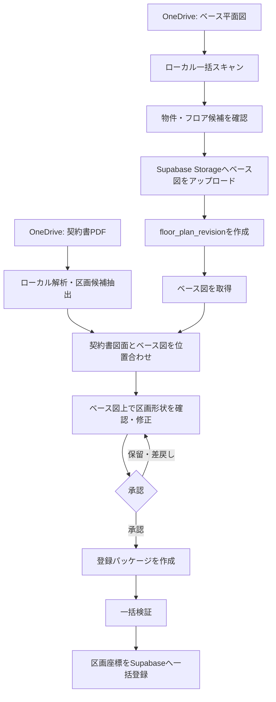

# 平面図一括登録・契約書区画照合 設計書

## 1. 目的

OneDrive に保管された各ビルのベース平面図を、物件・フロア単位で Supabase のリーシング図面として一括登録する。次に、契約書に含まれる区画図面から対象区画を確認し、**ベース平面図を基準**とした区画ポリゴンを作成する。承認済みの区画情報だけをまとめて Supabase へ登録する。

契約書原本・そのプレビュー・OCR 結果はローカルの OneDrive 配下に留め、Supabase へはベース平面図と、承認済みの区画座標だけを保存する。

## 2. 方針

1. ベース平面図の登録と、契約書図面からの区画情報作成を分離する。
2. 区画座標は常にベース平面図の相対座標（左上を `(0, 0)`、右下を `(1, 1)`）で保存する。
3. 契約書図面の赤枠などの座標を、そのまま登録しない。契約書図面とベース図の位置合わせを行った後の座標だけを登録する。
4. 自動検出は候補作成までとし、Supabase への書込みは利用者の承認後に限定する。
5. 取込は冪等にする。同一ファイルの再スキャン、同一フロアの再実行、途中失敗からの再開で重複登録しない。

## 3. 対象範囲

| 対象 | 本設計で扱う内容 |
| --- | --- |
| ベース図 | PDF、PNG、JPEG、SVG の登録。PDF は指定ページを表示用 PNG に変換する。 |
| 契約書図面 | ローカルで PDF を解析し、対象ページ・区画候補を確認する。 |
| 区画形状 | ベース図上の MultiPolygon を区画マスタの区画コードに紐付ける。 |
| 一括反映 | 承認済みの区画だけを検証し、まとめて反映する。 |
| 対象外 | 契約書原本の Supabase 保管、完全自動での区画確定、CAD 図面の直接編集。 |

## 4. 全体フロー



## 5. ベース平面図の一括登録

### 5.1 入力フォルダ規約

初期運用では、物件名とフロアを確実に判別できるよう、次の構成を標準とする。

```text
<ベース図ルート>/
  <物件名>/
    <フロア表記>/
      <平面図ファイル>
```

例: `ベース図/東京本社ビル/8F/基準階平面図.pdf`

ファイル名だけで判定する運用は補助扱いとし、判定できないものは「確認待ち」にする。フロア表記はシステムの `unit_master.floor_label` と完全一致させる（例: `8F`）。

### 5.2 スキャンと確認

- 拡張子、ファイルサイズ、更新日時、SHA-256 を記録する。
- 既に同じ SHA-256 を登録済みの場合は候補を再作成しない。
- PDF はページ数を表示し、対象ページを選択できるようにする。
- 物件名・フロアが `property_master` および対象フロアの区画マスタに一致しない場合はアップロード対象から除外する。
- 実行前に、登録・更新・保留の件数と対象一覧を表示する。

### 5.3 Supabase への登録

既存の `floor-plans` バケット、`floor_plan`、`floor_plan_revision`、`create_floor_plan_revision` RPC を利用する。

- Storage パス: `base-import/<取込ID>/<候補ID>/original.<拡張子>` および `preview.png`
- 原本はアップロード時のファイルをそのまま保存する。
- PDF の `preview.png` は選択ページを PNG 化したものとする。画像形式は原本をプレビューとして利用してよい。
- 図面を差し替える場合は同一フロアの新しい `floor_plan_revision` を作成する。旧版は履歴として残る。
- 初回のベース図登録では区画座標を作成・複製しない。

既存 RPC は新しい図面版の作成時に旧版の区画座標を複製するため、既存区画を持つフロアのベース図を差し替える場合は、座標を再確認する警告を表示する。縮尺・余白・向きが変わる差し替えでは、既存座標を自動で正しい位置にできないためである。

## 6. 契約書区画図面との照合

### 6.1 ローカル作業データ

取込ツールの作業データは `outputs/contract_plan_importer/` の SQLite とプレビュー画像に保存する。ここには次の情報を持つ。

| 種別 | 主な内容 |
| --- | --- |
| 契約書候補 | ローカル相対パス、ハッシュ、物件名、フロア、ページ番号、OCR結果、状態 |
| 区画候補 | 契約書上の候補ポリゴン、推定区画コード、信頼度、確認状態 |
| 位置合わせ | 契約書図面とベース図の対応点、変換行列、変換誤差、確認状態 |
| 登録パッケージ | 対象のベース図版、区画ID、変換後ポリゴン、承認者、作成日時 |
| 監査ログ | 候補作成、編集、承認、登録実行、エラー |

契約書 PDF の実体、契約書プレビュー、OCR の全文は Supabase に送信しない。

### 6.2 位置合わせ

契約書図面とベース図は、余白・縮尺・傾き・切抜きが異なる可能性がある。したがって契約書側の赤枠座標をベース図の座標として保存してはならない。

照合画面では左右に契約書図面とベース図を表示し、同じ位置を対応点として指定する。対応点は、外壁の角、柱芯、階段の角など、両図面で不変かつ明確な地点を選ぶ。

| 図面の差異 | 変換 | 必要な対応点 |
| --- | --- | --- |
| 位置・縮尺のみ | アフィン変換 | 3点以上 |
| 回転・傾き・台形歪みを含む | 射影変換（ホモグラフィ） | 4点以上 |

標準は射影変換とする。対応点が 4 点未満、変換後の誤差が規定値を超える、または変換後ポリゴンがベース図外へ出る場合は「要確認」とし、登録対象にしない。

変換後のポリゴンは必ずベース図上に重ねて表示し、ドラッグ編集または多角形の描き直しを可能にする。最終的に保存するのはこのベース図基準のポリゴンだけである。

### 6.3 区画コードの確定

- OCR・フォルダ名・ファイル名から区画コードを候補表示する。
- 候補は対象物件・フロアの `unit_master` に存在する区画だけを選択可能とする。
- 区画マスタにない場合は、既存の「区画追加」機能で作成するか、取込対象から保留にする。
- 同一のベース図版・区画IDに対して、承認済み候補を複数作らない。

## 7. 承認と一括登録

### 7.1 承認条件

各区画候補は、以下をすべて満たした場合だけ承認可能とする。

- 対応するベース図版、物件、フロアが確定している。
- 区画コードが対象フロアの有効な `unit_master` に一致する。
- 位置合わせが確定している、またはベース図上で手入力したポリゴンである。
- MultiPolygon が有効であり、すべての頂点が `0〜1` の範囲にある。
- 同一フロアの他の承認済み区画との重複がない。

### 7.2 登録パッケージ

承認済みデータから、次のような JSON をローカルに生成する。これは送信前に確認するための成果物であり、Git 管理しない。

```json
{
  "base_revision_id": "UUID",
  "property_name": "東京本社ビル",
  "floor_label": "8F",
  "units": [
    {
      "unit_code": "801",
      "geometry": { "type": "MultiPolygon", "coordinates": [] },
      "source": { "contract_sha256": "...", "page_number": 12 }
    }
  ]
}
```

登録パッケージには契約書ファイルのパス、画像、OCR 全文を含めない。

### 7.3 一括反映の手順

1. 登録パッケージを作成する。
2. dry-run で、図面版の現行性、区画マスタ存在、ポリゴン妥当性、重複を検査する。
3. エラーのあるフロアは反映対象から除外し、正常なフロアだけを一覧で確認する。
4. 利用者が実行を承認する。
5. フロア単位のトランザクションで `save_unit_plan_geometry` を呼び出す。
6. 成功・失敗・未実行をローカル監査ログへ記録し、結果一覧を出力する。

一括登録中に一部のフロアが失敗しても、別フロアの成功分は戻さない。失敗したフロアは原因を直して再実行できるよう、成功済み区画を重複登録しない。

## 8. 画面・操作設計

| 画面 | 主な操作 |
| --- | --- |
| ベース図取込 | OneDrive ルート選択、候補スキャン、物件・フロア修正、PDFページ選択、登録予定確認、一括登録 |
| 契約書候補 | 契約書フォルダをスキャンし、対象ページ・区画候補を絞り込む |
| 照合ワークスペース | ベース図取得、対応点の登録、変換誤差表示、区画ポリゴンの確認・編集、区画コード選択 |
| 承認一覧 | 承認・保留・差戻し、未解決エラー、フロア単位の進捗確認 |
| 一括登録結果 | dry-run 結果、実行確認、成功・失敗一覧、再実行対象の抽出 |

## 9. データ・API設計

### 9.1 既存データの利用

| データ | 役割 |
| --- | --- |
| `floor_plan` | 物件・フロアごとの平面図の論理単位 |
| `floor_plan_revision` | ベース平面図の版、原本・プレビューの Storage パス |
| `unit_plan_geometry` | ベース図相対座標による区画形状 |
| `plan_change_set` | 図面登録・区画編集の履歴 |
| `unit_master` | 物件・フロア・区画コードの正規マスタ |

### 9.2 必要な拡張

初期実装では位置合わせ・承認情報をローカル SQLite に保存し、Supabase の業務データを未承認候補で汚さない。将来、複数担当者で照合を分担する必要が出た時点で、候補・承認・位置合わせを Supabase の専用テーブルへ移す。

既存の `save_unit_plan_geometry` は区画ごとに変更履歴を作る。大量登録時の履歴をまとめたい場合は、後続で `save_unit_plan_geometry_batch` RPC を追加し、1フロア・1実行につき 1 件の `plan_change_set` を作る。

### 9.3 認証・権限

- ローカル取込ツールは、利用者本人の Supabase ログインセッションを利用する。
- service role key は取込ツール、フロントエンド、登録パッケージに含めない。
- 既存の RLS と `current_account_is_active()` により、図面・区画の更新権限を確認する。
- Storage は非公開バケット `floor-plans` を継続し、表示には署名付き URL を使う。

## 10. エラー処理と品質保証

| 条件 | 扱い |
| --- | --- |
| 物件名またはフロアを特定できない | 保留。自動登録しない。 |
| 同一ハッシュのベース図 | スキップし、既存候補を表示する。 |
| PDF 変換・OCR 失敗 | 保留。元ファイルとエラーを記録する。 |
| 対応点不足・変換誤差超過 | 要確認。承認不可。 |
| 区画マスタなし | 保留または明示的に区画を作成する。 |
| 区画ポリゴンの重複・範囲外 | 承認不可。ベース図上で修正する。 |
| 登録時に図面版が旧版になった | 対象フロアを失敗として再照合する。 |

受入確認では、少なくとも「同一図面」「縮尺のみ異なる図面」「回転した図面」「余白が異なる図面」「複数区画を含む図面」「区画マスタがない図面」を用意する。

## 11. 実装順序

1. ベース図取込コマンドを追加し、フォルダ規約に基づく候補作成と dry-run を実装する。
2. 承認済みベース図の Storage アップロードと `create_floor_plan_revision` 呼出しを実装する。
3. 契約書インポーターを、登録済みベース図の選択・取得に対応させる。
4. 対応点指定、射影変換、変換後ポリゴンの重ね表示・編集を実装する。
5. 承認条件・登録パッケージ・dry-run を実装する。
6. フロア単位の一括登録と、再実行可能な結果レポートを実装する。
7. 実運用の件数で試行し、必要に応じて定期スキャンを追加する。

## 12. 完了条件

- OneDrive の指定フォルダから、物件・フロア別のベース図を候補化し、確認後に一括登録できる。
- 登録済みのベース図を取得し、契約書図面との位置合わせ後に区画形状をベース図基準で確認・編集できる。
- 未承認の候補や契約書原本を Supabase へ保存しない。
- 承認済み区画だけを dry-run で検証し、フロア単位で再実行可能な一括登録ができる。
