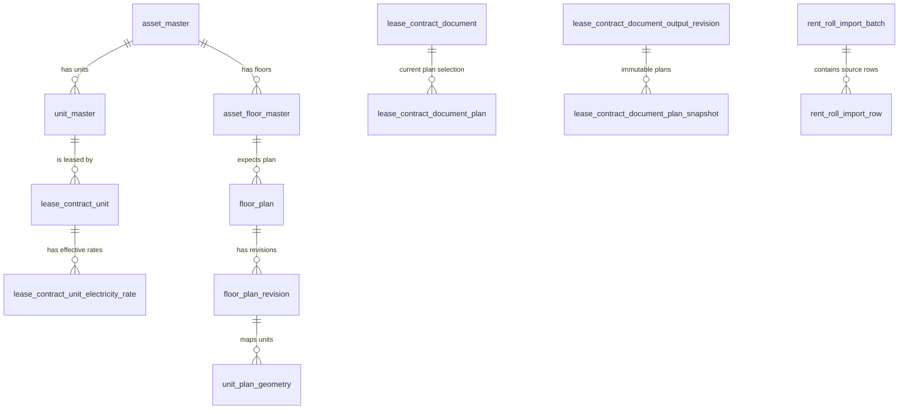

# 基幹システム改善 統合設計書（正式版）

版: 1.1（正式版）
作成日: 2026-08-07
対象: レントロール、物件・商品マスタ、区画図面、契約書作成
利用者: 物件運用担当者、承認者、マスタ管理者。日常操作にエンジニアを必要としない。

## 1. 結論

以下の順に実装する。データの正本を先に整備し、その結果を図面・契約書・レントロールへ一方向に参照させる。

1. **基盤整備**: アセット／階／商品区分と既存レントロールの照合基盤を整備する。
2. **データ是正**: Excelとの照合結果を承認し、商品区分・契約区画を安全に分割する。
3. **画面機能**: レントロールの種別表示・電気単価、区画図面の完全性表示を実装する。
4. **契約書出力**: 確定した区画図面を内容版ごとに固定して、契約書へ複数枚添付する。
5. **次期機能**: 検針データを取り込み、確定済みの電気単価から請求額を算定する。

この順序により、Excel照合が本番データを意図せず更新すること、未保存・不完全な図面が契約書に入ること、過去に出力した契約書の添付図面が後から変わることを防ぐ。

## 1.1 UX・保守性の設計原則

このシステムは、複雑なルールを利用者に覚えさせず、バックエンドが正しい手順へ導く構成とする。

1. **日常画面は「選ぶ・確認する・確定する」の3操作に絞る。** ID、SQL、Storageパス、技術的なステータスは表示しない。
2. **間違いは保存後ではなく確定前に防ぐ。** 必須項目、図面の未配置、照合差分、契約への影響を画面上で具体的に示す。
3. **自動判定には根拠を添える。** たとえば照合候補は一致した項目と不一致項目を、グレーアウトは理由と次の操作を表示する。
4. **破壊的な更新は承認と履歴を必須にする。** 契約区画の分割、照合結果の反映、正式な契約書出力は、前後比較・実行者・日時・理由を残す。
5. **マスタの保守は少人数に限定し、日常業務から切り離す。** 現場担当者はマスタを直接変更せず、申請または候補選択だけを行う。
6. **バックエンドは初期に整合性を保証する。** 画面上の制御だけに依存せず、DB制約・トランザクション・監査ログ・版管理で不正な状態を保存させない。

## 1.2 利用者ごとの役割

| 役割 | できること | できないこと |
| --- | --- | --- |
| 運用担当者 | Excel照合の開始、差分確認、図面登録・配置、契約書の下書き・確認 | マスタの確定変更、承認済みデータの直接上書き、過去出力の変更 |
| 承認者 | 差分反映、区画分割、図面の対象外扱い、正式出力の承認 | 技術設定・監査履歴の削除 |
| マスタ管理者 | 物件・階・商品区分の追加／修正、表示順管理 | 契約の業務判断を伴う変更の単独確定 |
| システム管理者 | 権限、障害ログ、孤児ファイル監査、テンプレート公開 | 日常データの業務判断 |

権限は画面の非表示だけでなく、DBのRLS・RPCで強制する。

## 2. 現状と設計上の重要所見

| 領域 | 確認できた現状 | 設計判断 |
| --- | --- | --- |
| 物件情報 | `asset_master` に住所、構造、地番用の `building_structure` / `lot_address` が既にある | 入力画面・必須チェック・未入力一覧を整備し、物件情報の唯一の正本にする |
| 商品区分 | `unit_master.unit_type` は既存の汎用区分。取込では名称推測により種別を付けている | 区画単位の区分として正規化し、推測値は要確認として移行する |
| レントロール | 全区画を一表に表示。取込スクリプトは更新型 | 商品チェックリストを追加。照合処理は取込・更新処理から分離する |
| 既存取込 | 直近レポートは734件、要確認253件。特殊レイアウト・重複区画が残る。JSONレポートは構文検証にも失敗 | Excel原本とDB状態を不変スナップショットとして保存し、差分を承認してから別処理で反映する |
| 区画図面 | `floor_plan` → revision → geometry の履歴構造はあるが、期待する階と全区画配置の保証がない | 階マスタと完全性ビューを追加し、未保存／未配置を明示・出力時にブロックする |
| 契約書図面 | 複数図面候補があってもWord出力は1枚に限定されうる。スナップショットの同一パス上書きもありうる | 出力内容版ごとに図面をimmutableに固定し、全図面を指定順で出力する |

## 3. 目標データモデル

### 3.1 アセット・階・商品区分

- `asset_master` を物件基本情報の正本とする。地番は `lot_address`、構造は `building_structure` に入力する。
- `asset_floor_master` を新設する。主な列は `asset_floor_id`、`asset_id`、`building_wing_id`、`floor_label`、`display_order`、`is_active`。`asset_id + 棟 + floor_label` を一意にする。
- 初期値は既存 `unit_master` と `floor_plan` から作成し、物件管理者が不足階（駐車場・共用階を含む）を補完する。
- 商品区分は区画 (`unit_master`) の属性とし、当面の固定コードは `office`、`parking`、`bicycle_parking`、`signage`、`warehouse`、`antenna` とする。既存の `storage` は `warehouse` へ、`equipment` は `antenna` 候補へ移行するが、機械移行分は承認対象とする。
- 商品名・表示順・有効／無効を運用で変更する必要がある場合は、上記コードをキーに `product_category_master` を追加する。`source_discriminator` は重複を避ける暫定技術キーであり、商品区分には利用しない。

### 3.2 電気代単価

`lease_contract_unit_electricity_rate` を新設し、単価を「物件」ではなく**契約区画 × 適用期間**に保持する。

| 列 | 内容 |
| --- | --- |
| `lease_contract_unit_id` | 対象の契約区画 |
| `effective_from`, `effective_to` | 適用期間。契約区画内で重複を禁止 |
| `rate_per_kwh` | 円/kWh、0以上、小数4桁まで |
| `tax_mode`, `rounding_mode` | 税込／税抜、端数処理規則 |
| `source`, `amendment_id`, `note` | 契約・覚書との根拠、備考 |

- 締結済み覚書由来の値には `amendment_id` を必須にする。
- レントロールは基準日時点で有効な単価を「電気単価（円/kWh）」として1列表示し、未設定は `—` とする。
- 今回はメーター・請求を作らない。次期で `meter_master` → `meter_reading` → `electricity_charge` を追加し、使用量 × 期間中の単価、税・丸め後の請求額を計算する。

## 4. 機能設計

### 4.1 物件情報入力

- アセット一覧に「入力が必要」「確認待ち」「完了」の業務状態を表示し、地番・構造の未入力件数から対象だけを開けるようにする。
- 住所・地番・構造の表記基準を定め、契約書の頭書へそのまま差し込む。
- 保存時は入力値を正規化せず原文を保持し、検索用の正規化値が必要になった時だけ別途保持する。
- 編集画面は入力項目に例を示し、保存前に契約書での表示プレビューを出す。マスタの変更は理由入力と承認待ちにできる構成とする。

### 4.2 商品分割とレントロール表示

- 1契約に複数の商品がある場合は、商品ごとに `lease_contract_unit` を作り、面積・賃料等を正しい商品区画へ配賦する。
- 元の集合区画は削除せず非アクティブ化し、旧区画→新区画の移行台帳と既存 `unit_lineage` により追跡可能にする。
- 有効な契約を持つ区画は、契約内容の確認と承認なしに分割しない。必要に応じて覚書またはデータ補正承認を経由する。
- レントロール画面には商品区分チェックリスト（全選択・全解除・物件ごとの選択状態保存）を置く。行に種別バッジ、商品別小計、表示中合計と全体合計を表示する。CSV出力にも同じ条件を適用する。
- 区画分割は自由編集画面では行わず、「分割候補の確認」ウィザードで実施する。元区画・新しい商品区画・金額配賦・契約影響を1画面で比較し、承認者が確定するまで本データを変更しない。

### 4.3 Excel照合

照合は既存 `import_rent_roll.py --apply` を使用しない。この処理は本番値をupsertし、取込外の契約を終了させうるためである。

1. 利用者は「照合を開始」からExcelと基準日を選ぶ。列の読み取り結果、対象件数、読み取れなかった行を確認してから照合を実行する。
2. Excelを読み込み、`rent_roll_import_batch`（ファイル名、SHA-256、基準日、取込日時、状態）と `rent_roll_import_row`（シート、行、正規化値、原文、業務キー）へ保存する。
3. 同じ基準日のDBを、契約状態・金額履歴・商品区分・電気単価を含むスナップショットビューとして取得する。
4. 完全一致キーは「物件・棟・階・区画・商品区分・テナントコード」。それ以外は候補として提示するだけで、自動一致しない。
5. 差分一覧に Excel値、DB値、種別、候補、担当者、承認／除外理由、修正リンクを保持する。差分種別は片側のみ、重複、商品、テナント、面積、金額、保証金、契約期間、電気単価とする。
6. 担当者は差分を「DBを修正」「Excelを修正」「今回は除外」の3択で処理する。反映対象は承認者がまとめて確認・確定し、途中状態は下書きとして保存する。
7. 承認済みの差分のみを、別の反映コマンドまたは管理画面で更新する。原本・比較結果・承認履歴は削除しない。

照合完了条件は「完全一致率100%」ではなく、**全差分に承認・修正・除外理由のいずれかが記録され、件数合計が一致すること**とする。

### 4.4 区画図面

- `floor_plan_coverage_status` ビューを追加し、階ごとに図面有無、対象アクティブ区画数、配置済み数、未配置区画、状態を返す。状態は `missing_drawing`、`incomplete_geometry`、`complete`、`no_unit`。
- 階マスタ・区画・図面の不整合は別診断ビューで `missing_floor_master`、`orphan_plan`、`unit_floor_unregistered` として返す。
- 図面保存RPCでは、区画と図面が同じ物件・棟・階であることを検証する。図面作成も階マスタにある範囲だけ許可する。
- 図面編集途中の未配置は許容するが、公開・契約書添付は `complete` のみ許可する。対象外にする場合は理由を記録する。
- フロアドロップダウンは階マスタを表示順で利用する。図面未保存の階はグレーアウトし、ツールチップで理由と登録導線を示す。登録後は有効化し、新版を自動選択する。自由入力は廃止する。
- 画面上部には「図面未登録」「未配置区画あり」「完了」を件数付きで常時表示する。未配置区画は一覧から選ぶと図面上で強調され、操作完了後に自動で次の未配置区画へ進む。
- 保存は自動保存ではなく明示的な「保存」ボタンを基本とし、保存済み・未保存・保存失敗を常に示す。編集途中に離れる場合は確認を求める。Undo/Redo、Esc取消、自己交差時の即時エラーを備える。
- アップロード後にDB登録に失敗した場合は、保存済みStorageファイルを補償削除し、失敗した場合は孤児監査へ記録する。

### 4.5 契約書作成・添付図面

- 入力フォームの保存内容を正本とし、Word確認後に同一内容版だけを正式PDF化する原則を維持する。テンプレートを改版しても過去の出力は変更しない。
- `lease_contract_document_plan` は編集時の現在選択として残す。一方、出力版ごとに `lease_contract_document_plan_snapshot` を作成し、`output_revision_id`、順序、図面revision、対象区画、スナップショットパス、SHA-256、作成日時を記録する。
- Storageパスは版・順序・ハッシュを含め、上書きを禁止する。現在の「削除→再挿入」「同じパスへのupsert」は出力版には使わない。
- Wordテンプレートは `planImages[]` と `hasPlans` を扱い、複数フロア・複数図面を指定順に改ページして添付する。
- 生成前に、内容版、テンプレート版、図面枚数、対象区画、プレビューを確認する。図面なし・形状なし・完全性未達・スナップショット失敗は生成不可とし、対応方法を表示する。
- 出力履歴には内容版、テンプレート版、図面ハッシュ、実行者・日時、状態、失敗概要、ダウンロードを表示する。
- 操作は「下書きを保存」→「内容と図面を確認」→「承認を依頼」→「正式版を出力」の段階に分ける。利用者には「第3版」「図面2枚」「確認待ち」のような業務表現を表示し、ハッシュや内部IDは管理画面だけに表示する。

## 4.6 運用を単純化するバックエンド方針

- 画面から複数テーブルを直接更新しない。重要な操作は、入力検証・整合性確認・履歴記録を1トランザクションで実施するDB RPCまたはEdge Functionを経由する。
- マスタ、契約、図面、照合、出力はすべて「下書き」「確認待ち」「確定」「取消」の業務状態を持たせる。状態遷移は許可された役割だけが実行できる。
- 既存データの移行は再実行可能な移行台帳で管理する。実行前後の件数・金額・対象IDを記録し、途中失敗時は利用者が個別に復旧する必要がないよう、処理単位を原子的にする。
- 日常の例外は `作業待ち一覧` に集約する。未入力物件、照合差分、図面未配置、出力失敗を同じ画面から担当者へ割り当て、メールや口頭連絡に依存しない。
- 監査ログは削除せず、業務画面では「いつ・誰が・何を変えたか」を読みやすく表示する。技術詳細はシステム管理者だけが参照する。
- バックアップ、Storage孤児掃除、失敗した出力の再試行、データ整合性チェックは定期ジョブ化する。定期ジョブの結果は管理者向けの1画面に集約する。

### 4.7 DeskNet's連携: 自動で変更案を作り、人がResolveして反映する

DeskNet'sで承認済みになった新規契約、更新、解約、区画変更、電気単価変更を、レントロールの正本へ直接反映しない。連携は**変更提案**を作成するまでとし、担当者のResolve操作で初めて正本へ反映する。

#### 変更提案・対応依頼のデータ

| テーブル | 目的 | 主な内容 |
| --- | --- | --- |
| `change_request` | 変更提案の親レコード | 発生元、種別、対象物件、状態、優先度、担当者、期限、原本への適用結果 |
| `change_request_item` | 差分の明細 | 項目名、現在値、提案値、判定、修正後の適用値、確認メモ |
| `change_request_comment` | スレッド形式のやり取り | 投稿者、本文、添付参照、投稿日時 |
| `change_request_action_log` | 操作の監査履歴 | 作成、担当変更、保留、差戻し、Resolve、適用失敗、再試行 |

- `change_request.source_type` は当初 `rent_roll_initial_cleanup` と `desknets` を持たせる。初期データ修正とDeskNet's連携を同じ画面・同じ状態遷移で扱えるようにする。
- 状態は `open`（未対応）、`in_review`（確認中）、`on_hold`（保留）、`returned`（差戻し）、`resolved`（確認完了・適用済み）、`failed`（適用失敗）とする。画面では「未対応」「確認中」「保留」「差戻し」「完了」「再対応が必要」と業務用語で表示する。
- 新規契約の場合、物件、区画、商品区分、テナント、契約期間、金額、電気単価、図面配置の有無を明細化する。既存契約との重複や図面未配置は警告として自動追加する。

#### ダッシュボードの操作設計

- ダッシュボードに「対応依頼」カードを置き、未対応件数、保留件数、期限超過件数を表示する。
- 一覧は物件、種別、状態、担当者、発生元で絞り込める。各行には業務上の要点だけを表示する（例: `○○ビル 5階 501号室 / 新規契約 / 図面確認待ち`）。
- 詳細画面では、現在のレントロール値と反映予定値を左右に並べ、差分だけを強調する。自動判定の根拠と、解消しなければならない警告を同じ場所に表示する。
- 利用者の操作は `Resolveして反映`、`修正して反映`、`保留`、`DeskNet'sへ差戻し`、`担当者変更` に限定する。`Resolveして反映` は確認ダイアログで変更件数と影響を再表示する。

#### Resolve時のバックエンド処理

`resolve_change_request(p_change_request_id, p_items, p_comment)` のようなRPCを用意し、以下を単一トランザクションで実行する。

1. リクエストが未解決であり、対象明細が最新であることを確認する。
2. 物件・階・区画・商品区分・契約期間・金額・図面完全性を再検証する。
3. 修正済みの提案値を、契約・区画・レントロールの正本へ反映する。
4. 更新前後の値、実行者、時刻、コメントを操作ログへ記録する。
5. リクエストを `resolved` に変更し、レントロールの再計算対象を登録する。

検証に失敗した場合は何も反映せず、`failed` と利用者向けの原因を記録する。画面から個別テーブルへ直接更新しない。

### 4.8 初期取込データの修正・適用ワークベンチ

今回取り込み済みで保留・確認対象となっている契約は、`rent_roll_import_issue` を単に一覧表示するだけではなく、上記 `change_request` として起票する。これを「デバッグ画面」ではなく、将来も利用できる**データ修正・適用ワークベンチ**として実装する。

#### 画面構成

| 画面 | できること |
| --- | --- |
| 対応依頼一覧 | 未対応／保留／完了を表示し、物件・問題種別・契約者・区画で絞り込む。複数件を選択して一括確認する。 |
| 差分詳細 | Excel原文、現在のDB値、反映予定値、問題理由、コメント履歴を比較する。 |
| 修正フォーム | 区画、商品区分、テナント、金額、期間などを候補選択・入力で修正する。 |
| 適用前確認 | 反映対象、前後差分、警告、件数・金額の合計を確認してから適用する。 |

- 対応種別は、特殊レイアウト、物件未一致、区画未一致、重複区画、結合区画、複数テナント、商品区分未設定、金額・期間差異を初期値とする。
- 操作は常に下書き保存できる。適用前にプレビューを出し、選択中の複数件を1回のRPCで反映する。
- 「除外」は削除ではなく、理由・実行者・日時を残して完了扱いにする。Excel原文と取込スナップショットは変更しない。

#### 権限と将来移行

- 現在は開発メンバーだけが利用するため、ログイン済み利用者は一覧・修正・適用を実行可能とする。
- ただしRPCに認可判定の入口を残し、運用開始時には「担当者は修正案作成まで、承認者だけがResolve・適用可能」へ設定変更だけで移行できるようにする。
- 初期データを解消した後も画面は廃止せず、DeskNet'sから作られる対応依頼の確認画面として継続利用する。

### 4.9 実装方式: SQLで土台を固め、画面でデータを調整する

実装は「**構造と安全装置はSQLマイグレーション、日々の調整はフロント画面**」に分ける。

| 層 | 実装するもの | 目的 |
| --- | --- | --- |
| SQLマイグレーション | `change_request`群、照合スナップショット、状態制約、外部キー、監査ログ、Resolve RPC、再計算キュー、RLS | どの画面から操作してもデータが壊れない土台を作る |
| Edge Function／連携 | DeskNet's承認結果の受信、変更提案の作成、差戻し通知、失敗時の再試行 | 外部連携を冪等にし、正本を直接更新しない |
| フロントエンド | ダッシュボード、対応依頼スレッド、差分比較、修正フォーム、適用前確認、一括操作 | 開発メンバー・将来の運用担当者が画面だけで調整できるようにする |

マイグレーションは、テーブル・制約・RPC・テストを同じ変更単位で追加する。初期データの修正内容はマイグレーションに書かず、ワークベンチで確認・適用する。これにより、スキーマ変更と業務データ修正の責任を分け、再現性と保守性を高める。

## 5. 実装バックログと進捗管理

| ID | タスク | 優先 | 依存 | 完了条件 |
| --- | --- | --- | --- | --- |
| M1 | アセットの地番・構造入力画面、未入力一覧 | 高 | なし | 物件ごとに入力・検索・契約書参照を確認 |
| M2 | 商品区分マスタ・区画移行台帳 | 高 | M1 | 6区分と旧→新の追跡が可能 |
| M3 | Excel／DB照合スナップショットと承認画面 | 最優先 | M2 | 原本・比較・承認履歴が残り、更新なしで照合できる |
| M4 | 承認済み差分のデータ是正 | 高 | M3 | 全差分の処置と再照合結果を記録 |
| M5 | レントロール種別フィルタ・小計・CSV | 中 | M2, M4 | 画面とCSVの件数・合計が一致 |
| M6 | 電気単価の期間管理・表示 | 中 | M4 | 基準日で有効な単価を一意に表示 |
| M7 | 階マスタ・図面完全性ビュー・DBガード | 最優先 | M2 | 未保存／不整合／未配置が一覧化される |
| M8 | 図面UIのグレーアウト・登録導線・保存UX | 高 | M7 | 未保存階は編集不可、登録後に有効化 |
| M9 | 契約書図面の版固定・複数枚Word出力 | 最優先 | M7 | 過去出力不変、全指定図面が出力 |
| M10 | 契約書の画面レビュー・テンプレート／法務UAT | 高 | M9 | Word/PDFの内容・レイアウトを承認 |
| M11 | 検針・請求額算定 | 次期 | M6 | 使用量、単価、税・丸めを監査可能に算定 |
| M12 | 作業待ち一覧・役割別承認・監査画面 | 高 | M3, M7, M9 | 日常の例外と承認がメール・SQLなしで完結 |
| M13 | 変更提案・対応依頼スレッドのSQL基盤 | 最優先 | M3 | 状態・差分・コメント・監査ログ・Resolve RPCを追加 |
| M14 | 初期取込データの修正・適用ワークベンチ | 最優先 | M13 | 保留・要確認契約を画面で修正、プレビュー、適用できる |
| M15 | DeskNet's承認結果からの変更提案作成 | 高 | M13 | 承認済みイベントが正本を直接更新せず対応依頼になる |

## 6. レビュー済みリスクと対策

| リスク | 対策 |
| --- | --- |
| 照合のつもりで取込を実行し契約を更新・終了させる | 読取専用の照合バッチを別にし、更新操作を承認済み差分へ限定 |
| 重複区画を技術的識別子のまま商品として扱う | `source_discriminator` を商品識別に用いず、商品区分・移行台帳で正規化 |
| 図面の未配置区画が契約書に含まれない | coverage完了を契約書添付・公開の必須ゲートにする |
| 図面更新で過去の契約書が変わる | 出力版ごとのimmutable snapshotと上書き禁止パス |
| 複数図面が契約書に反映されない | `planImages[]`、順序、改ページ、生成テストで保証 |
| PDF／Wordの日本語・図面レイアウト崩れ | テンプレート検証、自動結合テスト、実PDFの法務目視承認 |
| Storageの孤児ファイル | 補償削除と日次孤児監査 |

## 7. 受入テスト（横断）

- Excel行数、DB行数、一致・差分・除外の合計が一致する。既知の特殊レイアウト、結合区画、重複候補をテストデータに含める。
- 商品区分の表示切替後、行数・商品別小計・総計・CSVが同じ条件で一致する。
- 電気単価は基準日で1件だけ選ばれ、未設定・負数・適用期間重複は保存できない。
- 図面未保存階はグレーアウトされ、登録後は有効化される。別物件・別階の区画を保存しようとするとDBで拒否される。
- 全区画が未配置なく図面へ登録されるまで、契約書添付・公開はできない。
- 単一図面、複数区画、複数階の契約書で、対象図面が指定順・正しい赤枠・改ページでWord/PDFへ出る。
- 図面・テンプレートを更新しても、既出力のWord/PDFと図面ハッシュは不変である。

## 8. 着手前に確定する運用判断

1. 既存の `retail`、`residential`、`other` をどの商品の扱いにするか。
2. 商品分割時の賃料・共益費・保証金の配賦基準と、契約変更／覚書が必要となる境界。
3. 電気代の税区分・端数処理・検針日と請求対象期間の規則。
4. 図面に区画を置かないことを許容する場合の対象外理由・承認者。
5. 契約書テンプレートの図面ページ構成、表題・縮尺・凡例の法務承認。

上記以外は、本設計のデフォルトに沿って実装を進められる。

## 9. 正式版の管理

- 本書を2026-08-07時点の正式版1.1とする。要件または運用判断を変える場合は、変更理由・影響範囲・承認者を記録して改版する。
- 日常利用者向けの説明は、技術用語を省いた「やさしい説明版」を正とし、本書と同じ改版番号を付与する。
- 実装時は、本書の受入テストを満たすことをリリース条件とする。画面だけではなく、DB制約・権限・履歴・障害時の復旧を確認する。
