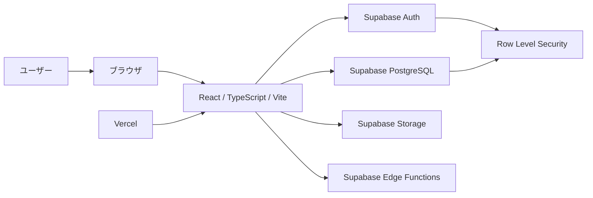

# システム設計書

## 1. システム概要

本システムは、React / TypeScript / Vite を用いたフロントエンドアプリケーションと、Supabase を用いたバックエンドサービスで構成する Web アプリケーションである。

ローカル開発では `localhost` 上で Vite 開発サーバーを起動し、Supabase のクラウドプロジェクトまたは Supabase CLI によるローカル環境へ接続する。将来的な本番デプロイ先は Vercel を想定し、静的フロントエンドのホスティング、環境変数管理、プレビュー環境の活用を前提とする。

主な設計方針は以下のとおり。

- フロントエンドは UI 表示、画面遷移、クライアント状態管理を担当する。
- バックエンドは Supabase の Auth、Database、Storage、Edge Functions などのマネージド機能を活用する。
- 認証・認可は Supabase Auth と Row Level Security（RLS）を中心に設計する。
- 環境差分は環境変数で吸収し、ローカル・プレビュー・本番で同一コードベースを利用する。

## 2. 技術スタック

| 領域 | 技術 | 用途 |
| --- | --- | --- |
| フロントエンド | React | UI コンポーネント構築 |
| フロントエンド | TypeScript | 型安全な実装 |
| ビルドツール | Vite | 開発サーバー、ビルド、環境変数注入 |
| バックエンド | Supabase | 認証、PostgreSQL、Storage、API 提供 |
| データベース | Supabase PostgreSQL | アプリケーションデータ永続化 |
| 認証 | Supabase Auth | ユーザー登録、ログイン、セッション管理 |
| 認可 | Supabase RLS | テーブル単位・行単位のアクセス制御 |
| ローカル開発 | localhost | 開発サーバーの実行環境 |
| デプロイ | Vercel | フロントエンドのホスティング、プレビュー環境 |

## 3. 全体アーキテクチャ



### コンポーネント責務

- **React アプリケーション**
  - 画面表示、ルーティング、フォーム入力、API 呼び出しを担当する。
  - Supabase JavaScript Client を通じて Supabase の各機能へアクセスする。
- **Supabase Auth**
  - ユーザー認証、セッション管理、OAuth 連携などを担当する。
- **Supabase PostgreSQL**
  - アプリケーションデータを保存する。
  - RLS を有効化し、ユーザーごとのアクセス範囲を制御する。
- **Supabase Storage**
  - 画像や添付ファイルなどのバイナリデータ保存に利用する。
- **Supabase Edge Functions**
  - クライアントに公開できない処理や、外部サービス連携などに利用する。
- **Vercel**
  - フロントエンドのビルドとホスティングを担当する。
  - Pull Request ごとのプレビュー環境を提供する。

## 4. ディレクトリ構成案

```text
.
├── docs/
│   └── system-design.md
├── public/
│   └── assets/
├── src/
│   ├── app/
│   │   ├── App.tsx
│   │   └── routes.tsx
│   ├── components/
│   │   ├── common/
│   │   └── layout/
│   ├── features/
│   │   └── example/
│   │       ├── components/
│   │       ├── hooks/
│   │       └── services/
│   ├── hooks/
│   ├── lib/
│   │   └── supabaseClient.ts
│   ├── pages/
│   ├── styles/
│   ├── types/
│   └── main.tsx
├── supabase/
│   ├── functions/
│   ├── migrations/
│   └── seed.sql
├── .env.example
├── index.html
├── package.json
├── tsconfig.json
└── vite.config.ts
```

### ディレクトリ方針

- `docs/`: 設計書、運用メモ、仕様書を配置する。
- `src/app/`: アプリケーションのエントリポイント、ルーティング、全体設定を配置する。
- `src/components/`: 複数機能で再利用する UI コンポーネントを配置する。
- `src/features/`: 機能単位のコンポーネント、hooks、services を配置する。
- `src/hooks/`: 汎用 hooks を配置する。
- `src/lib/`: Supabase Client など外部サービス接続用の初期化コードを配置する。
- `src/pages/`: 画面単位のコンポーネントを配置する。
- `src/types/`: アプリケーション全体で共有する型定義を配置する。
- `supabase/`: Supabase CLI 管理下のマイグレーション、Edge Functions、seed データを配置する。

## 5. Supabase 利用方針

### 利用する主な機能

- **Auth**
  - メールアドレス・パスワード認証を基本とする。
  - 必要に応じて OAuth プロバイダーを追加する。
- **Database**
  - PostgreSQL をアプリケーションの主要データストアとして利用する。
  - スキーマ変更はマイグレーションで管理する。
- **Row Level Security**
  - 原則として全テーブルで RLS を有効化する。
  - ユーザーが自身のデータのみ操作できるよう policy を定義する。
- **Storage**
  - ユーザーアップロードファイルを保存する。
  - バケットごとに公開・非公開の方針を明確化する。
- **Edge Functions**
  - サーバーサイドで実行すべき処理を配置する。
  - 外部 API キーなどクライアントに公開できない秘密情報を扱う処理に利用する。

### クライアント接続方針

- フロントエンドでは Supabase の anon key を利用する。
- service role key はフロントエンドへ絶対に公開しない。
- Supabase Client は `src/lib/supabaseClient.ts` などで一元的に生成する。
- 型定義は Supabase CLI などで生成し、DB スキーマと同期する。

## 6. 認証・権限設計

### 認証方針

- 初期実装ではメールアドレス・パスワード認証を採用する。
- セッション管理は Supabase Auth に委譲する。
- ログイン状態は React 側で購読し、画面表示やルーティング制御に反映する。
- パスワードリセット、メール確認、OAuth 追加は要件に応じて段階的に実装する。

### 権限設計

| ロール | 想定権限 |
| --- | --- |
| 未認証ユーザー | 公開ページの閲覧のみ |
| 認証済みユーザー | 自身に紐づくデータの作成・閲覧・更新・削除 |
| 管理者 | 管理対象データの閲覧・更新、ユーザー管理補助 |

### RLS 設計方針

- ユーザー所有データには `user_id` または `owner_id` を持たせる。
- RLS policy では `auth.uid()` と所有者 ID を比較する。
- 管理者権限は custom claims、profiles テーブル、または専用 role 設計で管理する。
- RLS だけでなく、フロントエンド側でも UI 表示制御を行う。ただし、最終的な認可は DB policy 側で担保する。

## 7. 環境変数設計

### フロントエンド環境変数

Vite ではクライアントに公開する環境変数に `VITE_` prefix を付与する。

| 変数名 | 用途 | 公開可否 |
| --- | --- | --- |
| `VITE_SUPABASE_URL` | Supabase プロジェクト URL | 公開可 |
| `VITE_SUPABASE_ANON_KEY` | Supabase anon key | 公開可 |
| `VITE_APP_ENV` | `local` / `preview` / `production` などの環境識別 | 公開可 |

### サーバーサイド・管理用環境変数

| 変数名 | 用途 | 公開可否 |
| --- | --- | --- |
| `SUPABASE_SERVICE_ROLE_KEY` | 管理者権限での Supabase 操作 | 公開不可 |
| `SUPABASE_ACCESS_TOKEN` | Supabase CLI や CI 用アクセストークン | 公開不可 |
| `SUPABASE_PROJECT_ID` | Supabase プロジェクト識別子 | 原則非公開 |

### 管理方針

- `.env.local` はローカル専用とし、Git 管理対象外にする。
- `.env.example` に必要な変数名のみを記載し、値はダミーにする。
- Vercel では Project Settings の Environment Variables に登録する。
- 本番用とプレビュー用の Supabase プロジェクトを分離することを推奨する。

## 8. ローカル開発方針

### 開発サーバー

- Vite の開発サーバーを `localhost` で起動する。
- 標準ポートは `5173` を想定する。
- 起動コマンド例は以下のとおり。

```bash
npm install
npm run dev
```

### Supabase 接続

ローカル開発では以下のいずれかを選択する。

1. **Supabase クラウド開発環境へ接続**
   - セットアップが簡単で、初期開発に適する。
   - 開発者間でデータを共有する場合はデータ破壊に注意する。
2. **Supabase CLI によるローカル環境を利用**
   - DB マイグレーション、seed、RLS の検証に適する。
   - 本番環境との差分を小さくしやすい。

### 開発時の注意事項

- DB スキーマ変更は直接変更ではなくマイグレーションとして管理する。
- RLS policy の変更は必ずローカルまたは開発環境で検証する。
- 認証が必要な画面と公開画面を明確に分離する。
- `.env.local` の秘密情報をコミットしない。

## 9. Vercel デプロイ方針

### デプロイ対象

- Vercel には Vite でビルドしたフロントエンドをデプロイする。
- Supabase は別サービスとして運用し、Vercel から環境変数経由で接続する。

### ビルド設定

| 項目 | 設定例 |
| --- | --- |
| Framework Preset | Vite |
| Build Command | `npm run build` |
| Output Directory | `dist` |
| Install Command | `npm install` |

### 環境分離

- Production 環境は本番 Supabase プロジェクトへ接続する。
- Preview 環境は検証用 Supabase プロジェクトへ接続する。
- Development 環境はローカルまたは開発用 Supabase プロジェクトへ接続する。

### デプロイ時の注意事項

- Vercel に登録する `VITE_` 付き環境変数はクライアントへ公開される前提で扱う。
- service role key などの秘密情報は Edge Functions または安全なサーバーサイド環境でのみ利用する。
- Supabase Auth の Site URL と Redirect URLs に Vercel の本番 URL・プレビュー URL を登録する。
- Pull Request ごとの Preview Deployment を活用し、UI と認証フローを確認する。

## 10. 今後の設計課題

- 画面一覧、ルーティング設計、ナビゲーション設計の具体化。
- データモデル、ER 図、テーブル定義、インデックス設計の作成。
- RLS policy の具体的な SQL 設計とテスト方針の整備。
- 認証方式の詳細化（メール確認、パスワードリセット、OAuth、MFA など）。
- 管理者権限の実装方式と運用フローの決定。
- Supabase Storage のバケット設計、ファイル命名規則、公開範囲の整理。
- Edge Functions の利用要否、責務分割、デプロイ手順の整理。
- エラーハンドリング、ログ収集、監視、アラート設計の検討。
- テスト戦略（単体テスト、結合テスト、E2E テスト）の策定。
- CI/CD パイプライン、マイグレーション適用フロー、リリース手順の整備。
- セキュリティレビュー、依存関係管理、秘密情報管理の運用設計。
